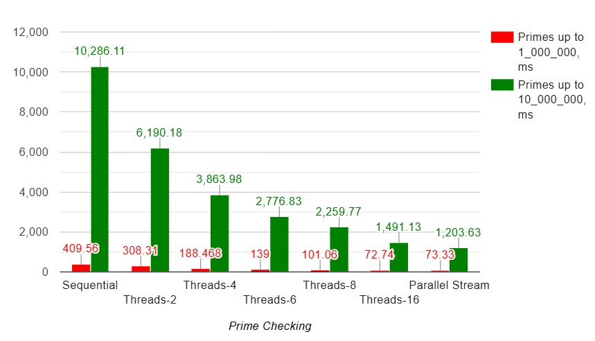
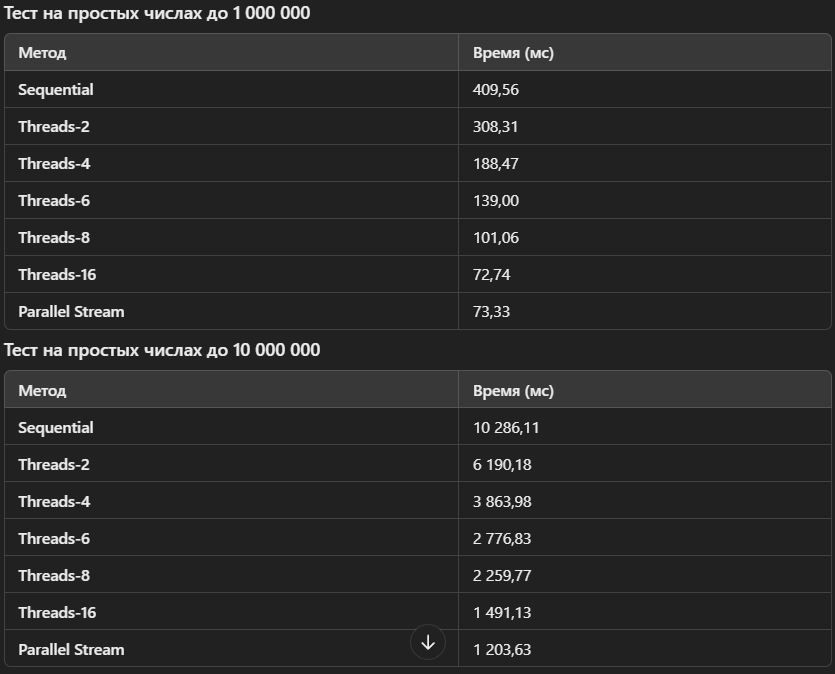

Описание диаграммы производительности проверки простых чисел
1. Введение
Диаграмма визуализирует результаты тестирования различных способов проверки массива чисел на наличие непростых (составных) чисел. В ходе эксперимента были использованы три подхода:

Последовательный (Sequential)
Многопоточный с разным числом потоков (Threads: 2, 4, 6, 8, 16)
Параллельный потоковый (Parallel Stream)
Цель тестирования – определить, какой из методов является самым быстрым при анализе большого массива чисел.

2. Тестовые данные
Использованы простые числа в диапазоне до 1 000 000 и до 10 000 000.
Простые числа были предварительно сгенерированы с помощью алгоритма Решето Эратосфена.
Проверяем, есть ли в массиве хотя бы одно непростое число.

3. Методология тестирования
Каждая реализация запускалась один раз для всего массива чисел.
Для измерения времени выполнения использовался следующий код:
    long startTime = System.nanoTime();
    boolean result = PrimeChecker.hasCompositeSequential(numbers);
    long endTime = System.nanoTime();
    double elapsedTimeMs = (endTime - startTime) / 1_000_000.0;
Аналогично проводилось тестирование для многопоточных и потоковых реализаций.

4. Итоги тестов

5. Интерпретация результатов
🔹 Sequential (Последовательный метод)

Самый медленный способ.
Время выполнения значительно возрастает с увеличением размера массива.
🔹 Threads (2–16 потоков)

Ускорение по сравнению с Sequential.
Оптимальный прирост наблюдается до 8 потоков.
После 8 потоков ускорение уменьшается (разница между 8 и 16 потоками незначительная).
🔹 Parallel Stream

Результат схож с 16 потоками (~1 203 мс для 10 млн чисел).
Потоковый API Java работает почти так же эффективно, как ручное управление потоками.
6. Выводы и рекомендации
Для небольших данных — Sequential прост и удобен, но медленный.
Для больших данных — многопоточные версии дают значительное ускорение.
Оптимальное число потоков – 8 (дальнейшее увеличение не дает большой выгоды).
Parallel Stream хорош для быстрого многопоточного решения без явного управления потоками.